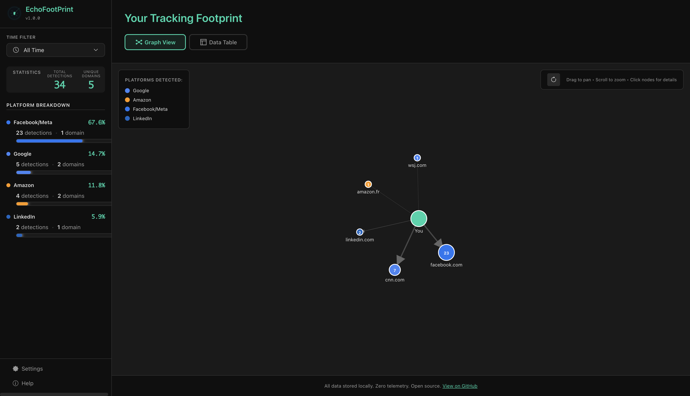
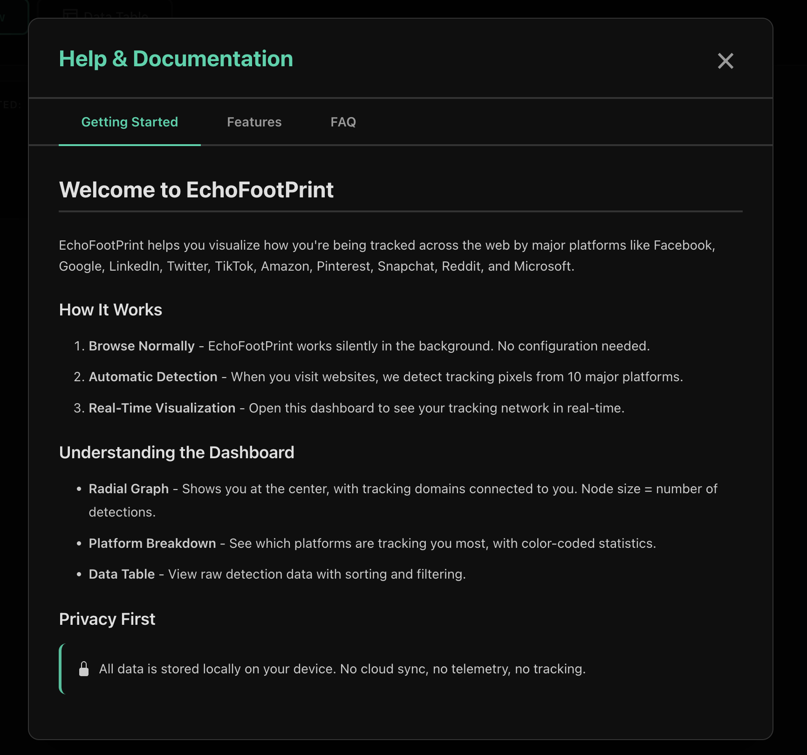
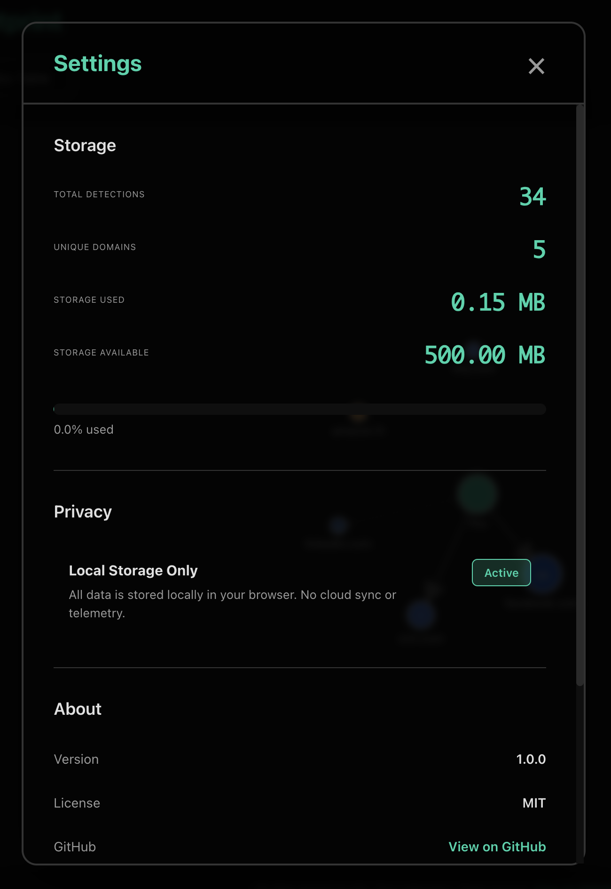

<div align="center">
  

  # EchoFootPrint

  > Privacy-first browser extension that visualizes cross-site tracking from 10 major platforms

  [](https://github.com/yourusername/echo-footprint)
  [](LICENSE)
  [](https://github.com/yourusername/echo-footprint)
</div>

## Overview

EchoFootPrint is a zero-configuration browser extension that empowers users to visualize how they're being tracked across the web. Unlike traditional privacy tools that simply block trackers, EchoFootPrint creates a compelling visual narrative of the tracking ecosystem through an interactive, client-side-only experience.

## Screenshots

### Dashboard

*Interactive radial graph showing your cross-site tracking network with real-time statistics*

### Help & FAQ

*Comprehensive help system with FAQs, features guide, and privacy information*

### Settings

*Data management, privacy controls, and extension settings*

**Detected Platforms:**
- Facebook/Meta (Instagram, WhatsApp)
- Google (YouTube, Analytics, DoubleClick)
- Twitter/X
- LinkedIn
- TikTok
- Amazon
- Pinterest
- Snapchat
- Reddit
- Microsoft/Bing (Clarity)

## Features

- ✅ **Multi-Platform Detection** - Tracks 10 major advertising platforms
- ✅ **Silent Operation** - Zero configuration, works automatically
- ✅ **Local-Only Storage** - IndexedDB storage with zero telemetry
- ✅ **Radial Graph Visualization** - Interactive D3.js force-directed graph
- ✅ **Platform Breakdown** - Color-coded statistics by platform
- ✅ **Data Table** - Raw data with sorting, filtering, and CSV export
- ✅ **Time Filters** - View tracking by 7 days, 30 days, or all time
- ✅ **Screenshot Export** - Export visualizations as PNG
- ✅ **Dark Mode UI** - WCAG 2.1 AA compliant interface
- ✅ **Help & Documentation** - Built-in comprehensive help system

## Quick Start

### Installation

1. Clone this repository
2. Install dependencies and build:
   ```bash
   npm install
   npm run build
   ```
3. Load in Chrome:
   - Open `chrome://extensions`
   - Enable "Developer mode"
   - Click "Load unpacked"
   - Select the `dist/` folder

### Usage

1. Browse the web normally
2. Click the EchoFootPrint extension icon to open the dashboard
3. View your tracking network in real-time
4. Use time filters to see historical data
5. Export data as CSV or screenshot visualizations

## Development

### Prerequisites

- Node.js 20+
- npm or pnpm

### Commands

```bash
# Development mode (watches for changes)
npm run dev

# Build for production
npm run build

# Lint code
npm run lint

# Format code
npm run format

# Run tests
npm test

# Package extension (creates .zip)
npm run zip
```

### Pre-commit Hooks (CI/CD Dry-Run)

This project uses **Husky** to run pre-commit hooks that simulate the GitHub Actions CI/CD pipeline locally. Every commit automatically runs:

1. **ESLint** - Code linting
2. **Prettier** - Format checking
3. **Tests** - Full test suite with coverage
4. **Build** - Production build verification
5. **Security Audit** - npm audit for vulnerabilities

This ensures that:
- ✅ Your commits will pass CI before pushing
- ✅ You catch issues early in development
- ✅ Code quality is maintained across all commits

**Setup** (automatic on `npm install`):
```bash
npm install  # Husky hooks installed automatically via "prepare" script
```

**Bypass** (not recommended):
```bash
git commit --no-verify  # Skip pre-commit checks
```

The pre-commit checks match exactly what GitHub Actions will run, giving you immediate feedback on whether your changes will pass CI.

### Project Structure

```
echo-footprint/
├── src/
│   ├── background/          # Service worker
│   ├── content/             # Content scripts
│   ├── dashboard/           # React dashboard UI
│   │   ├── components/      # React components
│   │   ├── styles/          # CSS files
│   │   └── utils/           # Database & utilities
│   └── lib/                 # Shared libraries
├── tests/                   # Test files
├── scripts/                 # Build scripts
├── docs/                    # Development documentation
└── dist/                    # Built extension (generated)
```

## Architecture

### Content Script
Injected into all web pages to detect tracking pixels by monitoring:
- Script tags from known tracking domains
- Image pixels (1x1 tracking beacons)
- iFrame embeds

Detection happens in <100ms per page with no performance impact.

### Service Worker
Manages:
- Message relay from content scripts
- Data persistence to IndexedDB
- Statistics calculation

### Dashboard
React 18 + Vite single-page application featuring:
- **Radial Graph**: D3.js force-directed graph with interactive controls
- **Platform Breakdown**: Real-time statistics with color-coding
- **Data Table**: Sortable, filterable table with export functionality
- **Settings**: Data management and privacy controls

## Privacy Guarantees

- ✅ **100% Local Storage** - All data stored in browser IndexedDB
- ✅ **Zero Telemetry** - No external servers, no analytics, no tracking
- ✅ **No Blocking** - Pure visualization, doesn't interfere with websites
- ✅ **Open Source** - MIT License, fully auditable code
- ✅ **No Permissions Abuse** - Minimal required permissions

## Platform Detection

EchoFootPrint detects tracking pixels by matching against known domain patterns:

| Platform | Detection Method | Example Domains |
|----------|-----------------|-----------------|
| Facebook/Meta | Script/Pixel | `connect.facebook.net`, `facebook.com/tr` |
| Google | Script/Pixel | `google-analytics.com`, `doubleclick.net` |
| Twitter/X | Script/Pixel | `analytics.twitter.com`, `platform.x.com` |
| LinkedIn | Script/Pixel | `snap.licdn.com`, `platform.linkedin.com` |
| TikTok | Script/Pixel | `analytics.tiktok.com` |
| Amazon | Script/Pixel | `amazon-adsystem.com` |
| Pinterest | Script/Pixel | `ct.pinterest.com` |
| Snapchat | Script/Pixel | `sc-static.net`, `tr.snapchat.com` |
| Reddit | Script/Pixel | `rdt.reddit.com`, `pixel.redditmedia.com` |
| Microsoft | Script/Pixel | `bat.bing.com`, `clarity.ms` |

## Documentation

Detailed development documentation is available in the `docs/` directory:
- [Product Requirements (PRD)](docs/phase-1-requirements/prd.md)
- [Technical Architecture (TAD)](docs/phase-1-requirements/tad.md)
- [Implementation Guide](docs/phase-1-requirements/IMPLEMENTATION_GUIDE.md)
- [Claude AI Instructions](docs/CLAUDE.md)
- [Sprint Summaries](docs/)

## Testing

```bash
# Run all tests
npm test

# Run specific test file
npm test tests/unit/db.test.js

# Run with coverage
npm run test:coverage
```

## Contributing

Contributions are welcome! Please:

1. Fork the repository
2. Create a feature branch (`git checkout -b feature/amazing-feature`)
3. Make your changes with tests
4. Ensure `npm run lint` and `npm test` pass
5. Commit with clear messages
6. Push to your fork
7. Open a Pull Request

### Code Style

- Use Prettier for formatting (`npm run format`)
- Follow ESLint rules (`npm run lint`)
- Write tests for new features
- Update documentation as needed

## Known Limitations

- **Chrome/Edge Only**: Currently supports Chromium-based browsers (Manifest V3)
- **Script Detection Only**: Detects script-based pixels, not cookie-based tracking
- **Performance**: Optimized for <500 domains, may slow with 1000+ unique domains
- **No Blocking**: Visualization tool only, doesn't prevent tracking

## Roadmap

- [ ] Firefox support (Manifest V2 branch)
- [ ] Additional platforms (Taboola, Outbrain, etc.)
- [ ] Export to JSON format
- [ ] Custom domain pattern matching
- [ ] Advanced filtering and search
- [ ] Browser action badge with detection count

## FAQ

**Q: Does EchoFootPrint block tracking?**
A: No. EchoFootPrint is a visualization tool to make tracking visible. Use uBlock Origin or Privacy Badger for blocking.

**Q: Is my data shared with anyone?**
A: No. All data stays on your device. We don't collect any telemetry or usage data.

**Q: Why don't I see tracking on platform websites?**
A: Platforms don't track themselves. Visit third-party sites (news, shopping, etc.) to see cross-site tracking.

**Q: Can I delete my data?**
A: Yes. Settings → Danger Zone → Clear All Data.

## License

MIT License - see [LICENSE](LICENSE) file for details.

## Acknowledgments

- Inspired by Mozilla's Lightbeam project
- Built with [D3.js](https://d3js.org/), [React](https://react.dev/), and [Dexie.js](https://dexie.org/)
- Icons from [Bootstrap Icons](https://icons.getbootstrap.com/)

## Status

**Current Version**: 1.1.0
**Status**: Production-ready with 10-platform detection
**Next Milestone**: Chrome Web Store submission

---

**Built with privacy, transparency, and user empowerment in mind.**

*Made with ❤️ for a more transparent web*
