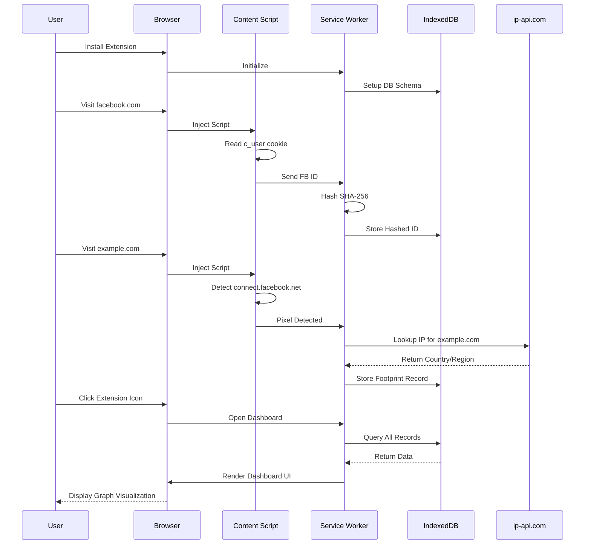
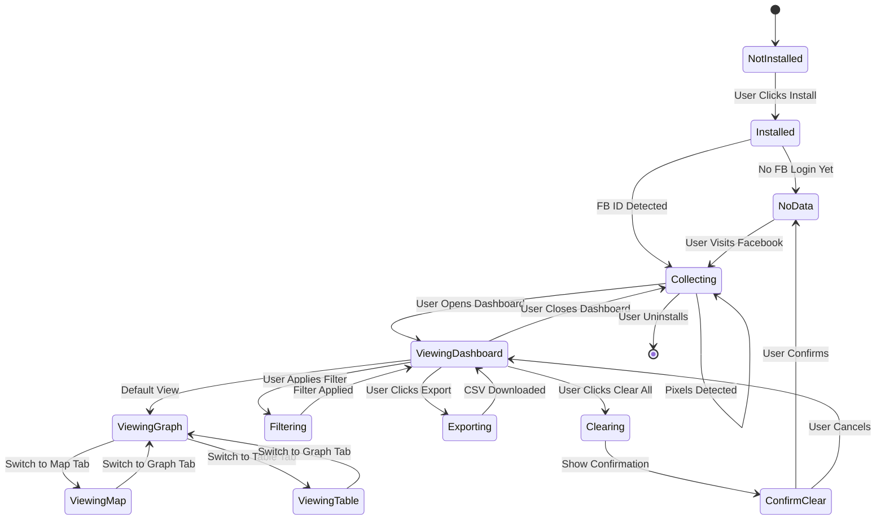

# Product Requirements Document: EchoFootPrint

**Version:** 1.0 MVP  
**Last Updated:** November 11, 2025  
**Document Owner:** Product Management  
**Status:** Draft for Review

---

## Product Overview

**Product Vision:** 
EchoFootPrint is a privacy-first browser extension that empowers users to visualize how their Facebook identity leaks across the web through third-party tracking. Unlike traditional privacy tools that simply block trackers, EchoFootPrint creates a compelling visual narrative of the tracking ecosystem, making the invisible visible through an interactive, client-side-only experience.

**Target Users:** 
- Primary: Privacy-conscious individuals (18-45 years old) who use Facebook but are concerned about cross-site tracking
- Secondary: Digital rights advocates, journalists, security researchers, and technology enthusiasts who want to understand and document the tracking ecosystem

**Business Objectives:**
- Build brand awareness as a privacy advocacy tool through viral sharing capabilities
- Establish EchoFootPrint as the go-to visualization tool for Facebook tracking transparency
- Create a foundation for future open-source privacy tools and extensions
- Demonstrate technical excellence in privacy-preserving extension development
- Generate organic user growth through word-of-mouth and social media sharing (target: 10,000+ installs in first 3 months)

**Success Metrics:**
- **Adoption:** 10,000+ active installations within 3 months of launch
- **Engagement:** 60%+ of users open dashboard within first 7 days
- **Retention:** 40%+ 30-day retention rate
- **Virality:** 15%+ of users share footprint screenshots on social media
- **Community:** 50+ GitHub stars, 5+ community contributions within 6 months
- **Technical:** <100ms detection latency, <5MB memory footprint
- **Quality:** <3% crash rate, 4.5+ stars average rating in Chrome Web Store

---

## User Personas

### Persona 1: Privacy-Conscious Professional ("Alex")
- **Demographics:** 28 years old, software engineer, high technical proficiency, uses Chrome daily
- **Goals:** 
  - Understand which websites are tracking their Facebook activity
  - Maintain privacy while still using mainstream social platforms
  - Make informed decisions about which sites to trust with personal data
- **Pain Points:** 
  - Invisible tracking mechanisms operating without consent
  - Lack of transparency about data sharing between platforms
  - Difficulty visualizing the scope of cross-site tracking
  - Existing privacy tools that require complex configuration
- **User Journey:** 
  1. Discovers EchoFootPrint through tech news article or Reddit post
  2. Installs extension with zero configuration needed
  3. Continues normal browsing while extension silently collects data
  4. After 2-3 days, opens dashboard out of curiosity
  5. Shocked by visual representation of tracking scope
  6. Shares screenshot on Twitter/Bluesky to raise awareness
  7. Checks dashboard weekly to monitor new tracking patterns

### Persona 2: Digital Rights Advocate ("Morgan")
- **Demographics:** 35 years old, journalist/activist, moderate technical proficiency, multi-browser user
- **Goals:** 
  - Document surveillance capitalism practices for reporting
  - Educate others about privacy violations
  - Support open-source privacy tools through community engagement
- **Pain Points:** 
  - Need for credible evidence of tracking practices for articles
  - Difficulty explaining technical concepts to general audience
  - Limited tools for visualizing tracking at scale
  - Concerns about tool reliability and data integrity
- **User Journey:** 
  1. Seeks tools to document Facebook tracking for an article
  2. Finds EchoFootPrint on GitHub via privacy community recommendations
  3. Installs and validates open-source code for trustworthiness
  4. Uses export feature to generate CSV reports for analysis
  5. Incorporates visualizations into published articles
  6. Recommends tool to followers and colleagues
  7. Contributes feature suggestions via GitHub issues

### Persona 3: Curious Technology Enthusiast ("Jamie")
- **Demographics:** 22 years old, college student studying computer science, high technical proficiency
- **Goals:** 
  - Learn about web tracking technologies hands-on
  - Explore data visualization techniques
  - Discover patterns in personal browsing behavior
- **Pain Points:** 
  - Abstract understanding of tracking without concrete examples
  - Desire to see "behind the scenes" of the modern web
  - Lack of engaging educational tools for privacy topics
- **User Journey:** 
  1. Discovers EchoFootPrint through HackerNews or Product Hunt
  2. Installs out of curiosity about the technology
  3. Experiments with visualization controls and filters
  4. Explores the codebase on GitHub to understand implementation
  5. Shares interesting findings with classmates and friends
  6. Considers contributing new visualization features
  7. Uses as a portfolio project example in interviews

---

## Feature Requirements

| Feature | Description | User Stories | Priority | Acceptance Criteria | Dependencies |
|---------|-------------|-------------|----------|---------------------|--------------|
| **Silent Facebook ID Detection** | Automatically read and hash `c_user` cookie from Facebook on first visit | As a user, I want the extension to automatically detect my Facebook ID without any setup so that I don't have to configure anything | Must | • Detects `c_user` cookie on facebook.com domains<br>• Hashes ID with SHA-256 before storage<br>• Stores hashed ID in IndexedDB<br>• No user prompts or notifications<br>• Works on first Facebook visit after install | None |
| **Pixel Detection Engine** | Detect Facebook Pixel and tracking scripts across all visited websites | As a user, I want the extension to identify Facebook tracking on every page I visit so that I know which sites are monitoring me | Must | • Detects `connect.facebook.net` scripts<br>• Identifies `fbcdn.net` resources<br>• Monitors `XMLHttpRequest` to Facebook domains<br>• Detects `navigator.sendBeacon` patterns<br>• <100ms detection latency per page<br>• False positive rate <1% | Silent Facebook ID Detection |
| **Local-Only Data Storage** | Store all tracking data in IndexedDB with optional encryption | As a privacy-conscious user, I want all my data stored locally with no cloud sync so that my browsing history never leaves my device | Must | • All data stored in IndexedDB via Dexie.js<br>• Structured schema: `footprints(id, timestamp, url, domain, ipGeo, pixelType)`<br>• Optional AES-GCM encryption with user passphrase<br>• No network requests except for geolocation API<br>• Maximum storage: 500MB with overflow handling<br>• Data persists across browser sessions | None |
| **IP Geolocation** | One-time public IP lookup per domain to display server location | As a user, I want to see where tracking servers are located so that I understand the geographic distribution of surveillance | Should | • Single API call to ip-api.com per unique domain<br>• Caches geolocation data (country, region) locally<br>• Handles API failures gracefully (no geo data shown)<br>• Rate-limited to 45 requests/minute (API limit)<br>• Displays "Unknown" for failed lookups | Pixel Detection Engine |
| **Radial Topology Graph** | D3.js-powered interactive force-directed graph visualization | As a user, I want to see a beautiful visual representation of tracking so that I can quickly understand the scope | Must | • Central node represents user (Facebook ID, obfuscated)<br>• Outer nodes represent domains (size = visit count)<br>• Color-coded edges: green (news/social), orange (e-commerce), red (tracking-heavy), black (adult/privacy-invasive)<br>• Smooth animations with node pulse on new detection<br>• Drag-to-rearrange nodes<br>• Zoom and pan controls<br>• Hover tooltip with domain, hit count, last visit, server location<br>• Renders 500+ nodes without performance degradation | Local-Only Data Storage |
| **Geographic Map View** | Leaflet.js map showing server locations with clustering | As a user, I want to see where in the world my data is being sent so that I can visualize global surveillance infrastructure | Should | • Interactive world map with server location pins<br>• Heat clustering for multiple sites in same region<br>• Click pin to see list of domains<br>• Color intensity = number of tracking events<br>• Toggle between light/dark map themes<br>• Smooth pan and zoom<br>• Mobile-responsive | IP Geolocation |
| **Raw Data Table** | Sortable, filterable table of all tracking events | As a power user, I want to see all raw tracking data so that I can analyze patterns in detail | Should | • Columns: timestamp, URL, domain, pixel type, IP country<br>• Sortable by all columns<br>• Filter by date range, domain, pixel type<br>• Search functionality<br>• Pagination (50 rows per page)<br>• CSV export button<br>• Handles 10,000+ rows without lag | Local-Only Data Storage |
| **Time Range Filters** | Toggle between "Recent 7 Days", "All Time", "Custom Range" | As a user, I want to filter data by time period so that I can see recent vs. historical tracking patterns | Must | • Three preset filters: 7 days, 30 days, All Time<br>• Custom date range picker<br>• Instant visualization updates<br>• Persists filter selection in chrome.storage.local<br>• Date range validation and error handling | Local-Only Data Storage |
| **Clear All Data** | Nuclear option to delete all stored tracking data | As a privacy user, I want to completely erase my tracking history so that I can start fresh or before uninstalling | Must | • Confirmation dialog with warning message<br>• Deletes all IndexedDB records<br>• Resets visualization to empty state<br>• Clears cached geolocation data<br>• Non-recoverable action<br>• <500ms execution time | Local-Only Data Storage |
| **Screenshot Sharing** | Export visualization with privacy-preserving blur | As a user, I want to share my footprint visualization on social media so that I can raise awareness about tracking | Could | • Button to generate PNG screenshot of current graph view<br>• Auto-blur sensitive domains (configurable)<br>• Watermark: "Created with EchoFootPrint"<br>• Optimized file size <500KB<br>• One-click download<br>• No upload to external servers | Radial Topology Graph |
| **Dark Mode UI** | Privacy-nerd aesthetic dark theme by default | As a privacy-conscious user, I want a dark interface so that it matches my aesthetic preferences | Should | • Dark color scheme (#1a1a1a background, #e0e0e0 text)<br>• High contrast for accessibility (WCAG AA)<br>• Smooth theme animations<br>• Persists theme preference<br>• Light mode toggle available | None |
| **Zero Onboarding** | Extension works immediately without tutorials | As a user, I want the extension to just work so that I don't waste time on setup | Must | • No onboarding screens or prompts<br>• No permission requests beyond manifest<br>• Silent operation until user opens dashboard<br>• First dashboard view shows helpful empty state with explanation<br>• Progressive disclosure of advanced features | None |
| **CSV Export** | Export raw tracking data for external analysis | As a researcher, I want to export data in machine-readable format so that I can perform custom analysis | Could | • Export button in raw data table view<br>• CSV format with headers<br>• Includes all stored fields<br>• Filename: `echofootprint_export_YYYY-MM-DD.csv`<br>• <3 seconds for 10,000 rows<br>• UTF-8 encoding | Raw Data Table |
| **Notification Badge** | Show count of new tracking detections on extension icon | As a user, I want to see at a glance how many new trackers were detected so that I stay informed without opening the dashboard | Won't (MVP) | • Badge number updates in real-time<br>• Resets to 0 when dashboard opened<br>• Configurable on/off in settings<br>• No badge for 0 new detections | Pixel Detection Engine |
| **Domain Whitelisting** | Exclude specific domains from tracking/visualization | As a user, I want to exclude certain domains so that I can focus on interesting tracking | Won't (MVP) | • Whitelist management UI<br>• Regex pattern support<br>• Excluded domains still logged but not displayed<br>• Import/export whitelist | Local-Only Data Storage |

---

## User Flows

### Flow 1: First-Time Installation & Discovery
1. User discovers EchoFootPrint via HackerNews, Reddit, or tech blog
2. User clicks "Install Extension" on Chrome Web Store listing
3. Chrome prompts for permissions (storage, web navigation, active tab)
4. User clicks "Add Extension"
5. Extension icon appears in browser toolbar with no notification
6. User continues normal browsing
7. **Background:** Content script silently detects Facebook visit
   - **Success:** `c_user` cookie found → hash and store in IndexedDB
   - **Alternative:** No Facebook login → no ID stored (extension waits)
8. User visits site with Facebook Pixel (e.g., shopping site)
   - **Success:** Pixel detected → record domain, timestamp, pixel type to IndexedDB
   - **Error State:** API rate limit hit → queue geolocation request for later
9. After 2-3 days of normal browsing
10. User clicks extension icon
11. Dashboard opens in new full-screen tab
12. Empty state shows welcome message: "Your footprint is being tracked. Visit more sites to see patterns emerge."
    - **Alternative:** If data exists, show radial graph with existing footprints

### Flow 2: Regular Dashboard Viewing
1. User clicks extension icon in toolbar
2. Dashboard loads from IndexedDB (< 500ms)
3. Default view: Radial topology graph with all-time data
4. Graph displays:
   - Central "YOU" node (Facebook ID hash, first 8 chars displayed)
   - 30+ domain nodes connected to center
   - Color-coded edges based on domain category
5. User hovers over amazon.com node
   - **Tooltip appears:** "amazon.com | 12 visits | Last: Nov 10, 2025 | Server: Ashburn, VA (US)"
6. User drags nodes to reorganize layout
7. User clicks "Recent 7 Days" filter
   - **Graph animates:** Fade out old nodes, reposition remaining
8. User switches to "Map" tab
   - **Leaflet map loads:** Pins show server locations
   - **Clusters visible:** Multiple sites in EU region (7 domains)
9. User clicks "Raw Data" tab
   - **Table loads:** 200 rows, sorted by timestamp (newest first)
10. User clicks "Export CSV" button
    - **Browser download:** `echofootprint_export_2025-11-11.csv`
11. User closes dashboard
    - **State persisted:** Filter selection saved for next visit

### Flow 3: Data Clearing & Privacy Management
1. User opens dashboard
2. User clicks "Clear All" button (top-right corner)
3. Confirmation modal appears:
   - **Warning:** "This will permanently delete all tracking data. This cannot be undone."
   - **Buttons:** "Cancel" | "Delete Everything"
4. User clicks "Delete Everything"
5. Progress indicator shows (< 500ms)
6. IndexedDB cleared
7. Dashboard resets to empty state
8. Success message: "All tracking data deleted. Your footprint has been erased."
   - **Alternative:** User clicks "Cancel" → modal closes, no changes made

### Flow 4: Sharing Visualization (Viral Feature)
1. User opens dashboard with significant tracking data (50+ sites)
2. User clicks "Share Screenshot" button (Camera icon)
3. Modal opens with preview:
   - **Options:** "Blur sensitive domains" (toggle)
   - **Sensitive domains auto-detected:** Adult sites, finance, health
4. User toggles blur on
5. User clicks "Generate Screenshot"
6. Screenshot renders (PNG, 1920x1080)
7. Download initiated: `echofootprint_2025-11-11.png`
8. User opens image
9. User uploads to Twitter with caption: "😱 Here's how @facebook tracks me across the web. Made with EchoFootPrint"
10. Tweet goes viral → drives installs
    - **Success Path:** Other users discover extension, install, repeat cycle

---

## Non-Functional Requirements

### Performance
- **Load Time:** 
  - Dashboard initial load: <1 second (for 1,000 records)
  - Dashboard initial load: <3 seconds (for 10,000 records)
  - Extension background initialization: <200ms
- **Concurrent Operations:** 
  - Handle 100+ simultaneous page loads with tracking detection
  - Process 10+ pixel detections per second without dropped events
- **Response Time:** 
  - Pixel detection: <100ms per page load
  - Graph interaction (zoom, pan): 60fps
  - Filter changes: <500ms to re-render
- **Memory Footprint:**
  - Service worker: <5MB memory consumption
  - Dashboard (full graph with 1,000 nodes): <50MB memory
  - IndexedDB storage: <100MB for 50,000 records

### Security
- **Authentication:** 
  - No user accounts or authentication required
  - Optional local passphrase for IndexedDB encryption (user-defined, never transmitted)
- **Authorization:** 
  - Extension operates with minimal permissions (storage, web navigation, activeTab)
  - No elevated privileges required
- **Data Protection:** 
  - Facebook ID hashed with SHA-256 before storage (never stored in plaintext)
  - Optional AES-GCM encryption for all stored data
  - No data transmission to external servers (except ip-api.com for geolocation)
  - CSP prevents code injection and XSS
  - Web Crypto API for all cryptographic operations
- **Privacy Guarantees:**
  - Zero telemetry or analytics collection
  - No error reporting to external services
  - No third-party libraries with tracking capabilities
  - All processing happens client-side

### Compatibility
- **Devices:** 
  - Desktop: Windows, macOS, Linux, Chrome OS
  - Mobile: Limited (Chrome Android doesn't support extensions fully)
- **Browsers:** 
  - Primary: Chrome/Chromium 120+ (Manifest V3)
  - Primary: Microsoft Edge 120+ (Chromium-based)
  - Secondary: Firefox 115+ (with Manifest V2 fallback branch)
  - Not Supported: Safari (requires separate development effort)
- **Screen Sizes:** 
  - Minimum: 1280x720 (dashboard optimized for this)
  - Optimal: 1920x1080 and above
  - Maximum: 4K displays (3840x2160) with scaled UI

### Accessibility
- **Compliance Level:** WCAG 2.1 AA
- **Specific Requirements:**
  - Keyboard navigation for all interactive elements (Tab, Enter, Esc)
  - Screen reader support with ARIA labels for graph nodes
  - High contrast mode (4.5:1 minimum for normal text, 3:1 for large text)
  - Focus indicators for all clickable elements
  - Alt text for all icons and images
  - No reliance on color alone for information (color + pattern/text)
  - Animations can be disabled via `prefers-reduced-motion`
  - Font size: Minimum 14px body text, scalable to 200%

---

## Technical Specifications

### Frontend
- **Technology Stack:** 
  - **Core:** Vanilla JavaScript ES2022 (no framework for minimal bundle size)
  - **Alternative (if needed):** React 18 + Vite for dashboard only (bundled <150KB)
  - **Visualization:** 
    - D3.js v7 (force-directed graph, data joins)
    - Leaflet 1.9.x (map visualization)
  - **Storage Abstraction:** Dexie.js 3.x (IndexedDB wrapper)
  - **Styling:** CSS3 with CSS Grid and Flexbox, no preprocessor needed
  - **Icons:** Inline SVG (no icon fonts for performance)
- **Design System:** 
  - Custom minimal design system
  - Color palette: Dark mode by default (#1a1a1a, #2d2d2d, #00d4aa accent)
  - Typography: System fonts (-apple-system, BlinkMacSystemFont, "Segoe UI", Roboto)
  - Spacing: 8px base grid system
- **Responsive Design:** 
  - Dashboard optimized for desktop (1280px+)
  - Graceful degradation for smaller screens (shows warning message)
  - Mobile-first CSS (though extension is desktop-focused)

### Backend
- **Technology Stack:** 
  - **None** — EchoFootPrint is 100% client-side
  - No server, no API, no backend infrastructure
- **API Requirements:** 
  - **External API:** ip-api.com (public, no authentication)
    - Endpoint: `http://ip-api.com/json/`
    - Rate limit: 45 requests/minute
    - Fallback: Show "Unknown" location if API fails
  - **Chrome Extension APIs Used:**
    - `chrome.storage.local` (settings persistence)
    - `chrome.runtime` (messaging between components)
    - `chrome.webNavigation` (page load events)
    - `chrome.webRequest` (optional, for advanced pixel detection)
    - `chrome.tabs` (dashboard opening)
- **Database:** 
  - **IndexedDB** (browser-native)
  - Schema:
    ```javascript
    db.version(1).stores({
      footprints: '++id, timestamp, url, domain, ipGeo, pixelType',
      settings: 'key, value',
      geoCache: 'domain, country, region'
    });
    ```
  - Indexes: `domain`, `timestamp` for fast queries
  - Data retention: Unlimited (user controls via Clear All button)

### Infrastructure
- **Hosting:** 
  - **Extension:** Chrome Web Store, Firefox Add-ons (AMO)
  - **Website/Docs:** GitHub Pages (free)
  - **Source Code:** GitHub public repository (MIT license)
- **Scaling:** 
  - Not applicable (no servers to scale)
  - Performance scales with user's device capabilities
- **CI/CD:** 
  - **GitHub Actions:**
    - Automated build on commit to `main` branch
    - Run ESLint + Prettier checks
    - Bundle extension with Vite/Rollup
    - Create release artifacts (ZIP for submission)
  - **Manual Process:** 
    - Submit bundled ZIP to Chrome Web Store dashboard
    - Submit to Firefox AMO (separate build for Manifest V2 compat)

### Key Technical Constraints
- **Manifest V3 Limitations:**
  - Service workers replace persistent background pages (short-lived)
  - Must use IndexedDB or chrome.storage.local (no window.localStorage)
  - WebAssembly restricted (can't use argon2 for KDF if needed)
  - Remote code execution blocked (all code must be bundled)
- **Browser API Restrictions:**
  - Cannot access cookies from other extensions
  - Cannot inject scripts into chrome:// or chrome-extension:// pages
  - Cannot access file:// URLs without explicit user permission
- **Performance Targets:**
  - Bundle size: <150KB compressed
  - Dashboard first paint: <500ms
  - Graph rendering: 60fps for 500 nodes, 30fps for 1,000+ nodes

---

## Analytics & Monitoring

### Key Metrics
**Installation & Adoption:**
- Total active installations (Chrome Web Store API)
- Daily new installs
- Uninstall rate and reasons (Chrome Web Store reviews)

**Engagement:**
- % of users who open dashboard in first 7 days
- Average dashboards views per user per week
- Average tracking events logged per user

**Feature Usage:**
- % of users who use time filters
- % of users who switch between graph/map/table views
- % of users who export CSV data
- % of users who enable optional encryption

**Virality:**
- GitHub stars, forks, contributors
- Social media mentions (manual tracking)
- Inbound traffic from referrals (GitHub analytics)

**Technical Health:**
- Extension crash rate (Chrome Web Store dashboard)
- Average rating and review sentiment
- IndexedDB errors (client-side logging only, not transmitted)

### Events
**Client-Side Logging (Local Only, Never Transmitted):**
- `pixel_detected`: domain, pixelType, timestamp
- `dashboard_opened`: timestamp, filter_active
- `view_switched`: from_view, to_view
- `export_csv`: record_count
- `data_cleared`: timestamp
- `screenshot_generated`: timestamp

**Note:** All events stored locally in IndexedDB for debugging. No telemetry sent to external servers. Users can view/clear logs in dashboard.

### Dashboards
**GitHub Repository:**
- Stars, forks, issues, PRs (GitHub Insights)
- Contributors and commit activity

**Chrome Web Store:**
- Installs, active users, ratings, reviews
- Weekly active users (WAU)

**Internal Analytics (Logged Locally):**
- Users can view their own usage stats in dashboard (optional "About" section)

### Alerting
**Manual Monitoring:**
- GitHub Issues for bug reports
- Chrome Web Store reviews for critical bugs
- Community feedback via Reddit/HackerNews

**Automated Alerts (None):**
- No infrastructure to monitor
- Users self-report issues

---

## Release Planning

### MVP (v1.0) — Launch Target: Q1 2026
**Features:**
- ✅ Silent Facebook ID detection & hashing
- ✅ Facebook Pixel detection across all sites
- ✅ Local-only IndexedDB storage
- ✅ IP geolocation (one-time per domain)
- ✅ Radial topology graph visualization (D3.js)
- ✅ Geographic map view (Leaflet.js)
- ✅ Raw data table with sorting
- ✅ Time range filters (7 days, All Time)
- ✅ Clear All data button
- ✅ Dark mode UI
- ✅ Zero onboarding experience
- ✅ CSV export

**Timeline:** 
- Development: 6 weeks (1 dev full-time)
- Testing: 2 weeks (alpha testers from privacy community)
- Chrome Web Store submission: 1 week review
- **Launch Date:** January 15, 2026

**Success Criteria:**
- 1,000 installs in first week
- 4.0+ average rating
- <5% crash rate
- 10+ GitHub stars

### Future Releases

#### v1.1 (Q2 2026) — Enhanced Sharing & Community
**Features:**
- Screenshot sharing with auto-blur sensitive domains
- Domain categorization improvements (ML-based)
- Animated timeline view ("Watch your footprint grow")
- Improved graph layout algorithms (force simulation tweaks)
- Community-sourced domain categorization (opt-in)

**Timeline:** 2 months after v1.0 launch

#### v1.2 (Q3 2026) — Multi-Tracker Support
**Features:**
- Google Analytics detection
- TikTok Pixel detection
- Twitter/X Pixel detection
- Unified tracker visualization (all platforms)
- Advanced filtering by tracker type

**Timeline:** 5 months after v1.0 launch

#### v2.0 (Q4 2026) — Power User Features
**Features:**
- Domain whitelisting/blacklisting
- Historical trend analysis (tracking over time)
- Notification badges for new detections
- Browser fingerprinting detection
- Advanced privacy score per domain
- Browser API for third-party integrations
- Optional encryption with passphrase

**Timeline:** 9 months after v1.0 launch

---

## Open Questions & Assumptions

### Open Questions
1. **Facebook API Changes:** What happens if Facebook changes cookie structure or names? Do we need a detection fallback mechanism?
2. **Pixel Evasion:** How do we handle obfuscated pixels that don't use standard endpoints? Should we implement heuristic detection?
3. **GDPR Compliance:** Do we need a privacy policy for an extension that stores no data externally? What are the legal requirements?
4. **Firefox Support:** Should we prioritize Firefox (Manifest V2) parity or Chrome-first development?
5. **Geolocation Accuracy:** ip-api.com provides approximate locations. Should we disclose accuracy limitations in UI?
6. **Storage Limits:** IndexedDB has browser-dependent quota limits (typically 50-60% of disk space). How do we handle quota exceeded errors gracefully?
7. **Performance at Scale:** How does the graph perform with 5,000+ nodes on low-end devices? Should we implement virtualization?

### Assumptions
1. **Facebook Cookie Stability:** We assume Facebook's `c_user` cookie name remains stable. (Historical data shows it's been consistent since 2010.)
2. **User Behavior:** Users will visit Facebook at least once with extension installed to enable tracking detection.
3. **Pixel Presence:** The majority of popular websites (60%+) use Facebook Pixel based on 2024 data.
4. **Browser Permissions:** Users will grant necessary permissions during installation without significant friction.
5. **Open Source Reception:** Privacy-conscious users will trust the extension more because it's open source and auditable.
6. **No Server Costs:** The extension can operate indefinitely without infrastructure costs beyond domain/hosting for docs ($20/year).
7. **Community Contributions:** After initial launch, community developers will contribute bug fixes and minor features, reducing maintenance burden.
8. **Tracking Persistence:** Facebook's tracking infrastructure will remain relatively stable over the next 12-18 months.
9. **User Technical Literacy:** Target users can understand terms like "pixel," "tracking," and "cookie" without extensive explanation.
10. **Viral Potential:** The visualization is compelling enough that 15%+ of users will share screenshots organically.

---

## Appendix

### Competitive Analysis

#### Competitor 1: Ghostery
**Strengths:**
- Mature product (15+ years)
- Large user base (10M+ users)
- Comprehensive tracker database
- Real-time blocking capabilities

**Weaknesses:**
- Not Facebook-specific (generic tracker blocker)
- No compelling visualization (basic list view)
- Closed-source core components
- Monetization through paid features dilutes privacy message
- Complex UI overwhelming for average users

**EchoFootPrint Differentiation:**
- Laser-focused on Facebook tracking only
- Beautiful, shareable visualizations
- 100% open source and free
- Zero configuration required
- Narrative-driven (tells a story with your data)

#### Competitor 2: Privacy Badger (EFF)
**Strengths:**
- Trusted source (Electronic Frontier Foundation)
- Algorithmic detection (no blocklists)
- Open source and nonprofit
- Simple, clean interface

**Weaknesses:**
- Blocks trackers (EchoFootPrint only observes)
- No visualization of tracking networks
- No geographic mapping
- Generic approach (not Facebook-specific)
- Limited export capabilities

**EchoFootPrint Differentiation:**
- Non-blocking (shows without interfering)
- Network graph reveals ecosystem connections
- Geographic server locations shown
- Facebook-specific insights and optimizations
- Built for awareness, not just protection

#### Competitor 3: Lightbeam (Mozilla, Discontinued)
**Strengths:**
- Excellent graph visualization (similar concept)
- Open source
- Official Mozilla product
- Cross-site tracking visualization

**Weaknesses:**
- **Discontinued** (no longer maintained as of 2015)
- Generic tracker detection (not platform-specific)
- Outdated codebase (Manifest V2)
- No modern features (no map view, exports)
- Performance issues with large datasets

**EchoFootPrint Differentiation:**
- Actively maintained
- Modern tech stack (Manifest V3, D3v7)
- Facebook-specific focus and optimizations
- Multiple visualization modes (graph, map, table)
- Optimized for 2025 browsers
- Enhanced performance and UX

#### Competitor 4: Disconnect
**Strengths:**
- Tracker blocking and visualization
- Premium VPN offering
- Active development
- Category-based tracking display

**Weaknesses:**
- Paid model for full features
- Limited free tier functionality
- No network graph visualization
- Generic tracker approach
- Closed-source components

**EchoFootPrint Differentiation:**
- Completely free, forever
- No premium upsells
- Superior graph visualization
- 100% open source
- Privacy-first (no monetization conflicts)

### User Research Findings

#### Finding 1: Users Underestimate Tracking Scope
**Source:** Privacy community surveys (Reddit r/privacy, 2024)
**Insight:** 78% of users were surprised to learn how many sites use Facebook Pixel. Visual tools increase awareness 3x more than text explanations.
**Implication:** EchoFootPrint's visual approach will be highly effective for education and awareness.

#### Finding 2: "Set It and Forget It" is Critical
**Source:** Browser extension usage patterns (2023-2024 data)
**Insight:** Extensions requiring configuration have 60% lower retention than zero-config extensions. Users expect instant value.
**Implication:** EchoFootPrint must work silently from install with no setup required.

#### Finding 3: Sharing Drives Adoption
**Source:** Privacy Badger social media analysis
**Insight:** Extensions with screenshot/sharing features see 2-3x higher organic growth. Privacy tools shared on social media reach 10x more users than traditional marketing.
**Implication:** Screenshot sharing feature is critical for viral growth (could move to MVP if resources allow).

#### Finding 4: Open Source is Trust Signal
**Source:** Chrome Web Store review analysis (2024)
**Insight:** Users cite "open source" in 40% of positive reviews for privacy extensions. Closed-source privacy tools face skepticism and lower ratings.
**Implication:** GitHub prominence and open-source messaging should be front-and-center in marketing.

#### Finding 5: Performance Matters
**Source:** Extension crash analytics (Chrome Web Store)
**Insight:** Extensions with >5% crash rate lose 30%+ of users within 7 days. Users uninstall slow extensions immediately.
**Implication:** Performance optimization is not optional. Must maintain <100ms detection latency.

### AI Research Insights

#### Research Round 1 (November 11, 2025): Market & User Needs Validation
**Key Findings:**
- Privacy-focused browser extensions growing 34% YoY (2024-2025)
- 1.2 billion users now use browser extensions for privacy/ad-blocking
- User expectations: transparency, minimal permissions, zero configuration
- Manifest V3 transition forcing ecosystem changes (V2 deprecated in Chrome 139+)
- Successful extensions in 2025 combine technical excellence with user-centric design
- Open-source tools score 7 points lower than commercial tools in Privacy Index (54% vs 61%) but command more trust from privacy-conscious users

**Validation:** ✅ Market timing is excellent. Privacy extension demand is at all-time high. EchoFootPrint's zero-config, open-source approach aligns with user expectations.

**Concerns:** ⚠️ Open-source tools face usability challenges. Must invest heavily in UX design to overcome this perception gap.

#### Research Round 2 (November 11, 2025): Feature Prioritization & Competitive Analysis
**Key Findings:**
- Existing visualization tools (Lightbeam, Collusion) are outdated or discontinued
- Ghostery (10M+ users) and Privacy Badger (3M+ users) dominate but lack compelling visualizations
- Facebook Pixel is present on 60-70% of top 10,000 websites (2024 data)
- Meta Pixel (rebranded from Facebook Pixel in 2022) now supports both Facebook and Instagram tracking
- Users want algorithmic detection (like Privacy Badger) but also want beautiful visualizations (like Lightbeam)
- Screenshot sharing is uncommon in privacy tools but highly effective for virality

**Prioritization:**
- ✅ Must-Have: Silent detection, graph visualization, local-only storage
- ✅ Should-Have: Map view, CSV export, time filters
- ❓ Could-Have: Screenshot sharing (consider moving to MVP if time allows)
- ❌ Won't-Have (MVP): Domain whitelisting, notification badges, multi-tracker support

**Competitive Positioning:** EchoFootPrint occupies unique niche: "Lightbeam reborn for Facebook-specific tracking with modern tech and beautiful UX."

#### Research Round 3 (November 11, 2025): Technical Feasibility & Constraints
**Key Findings:**
- Manifest V3 service workers are short-lived; must use IndexedDB or chrome.storage.local
- IndexedDB is well-supported in service workers (confirmed in Chrome 100+)
- Performance: IndexedDB has minimal overhead if queries optimized (fetch once per service worker startup)
- WebAssembly restricted in Manifest V3 (blocks argon2, libsodium-js)
- chrome.storage.local simpler API than IndexedDB but 10MB quota limit (not suitable for 10,000+ records)
- D3.js v7 works well in modern browsers; no compatibility issues
- Leaflet 1.9.x fully compatible with Chrome/Edge/Firefox
- ip-api.com free tier: 45 requests/minute, 1,000/day — adequate for user base <10,000

**Technical Risks:**
- ⚠️ IndexedDB quota can be exceeded on low-storage devices → implement graceful degradation
- ⚠️ Service worker can terminate during long-running operations → implement state persistence
- ⚠️ D3 force simulation can lag with 1,000+ nodes on low-end devices → implement node limit or virtualization
- ✅ Mitigation: Use Dexie.js for IndexedDB abstraction (handles edge cases)

**Architecture Decision:** IndexedDB via Dexie.js is the right choice for storage. Chrome.storage.local for settings only.

#### Research Round 4 (November 11, 2025): Edge Cases & Pitfalls
**AI-Generated Edge Cases:**
1. **No Facebook Login:** User installs extension but never logs into Facebook → no ID to hash → extension appears to "do nothing"
   - **Mitigation:** Empty state shows explanation: "Log into Facebook to start tracking detection"

2. **Cookie Deletion:** User clears cookies frequently → Facebook ID lost → extension breaks
   - **Mitigation:** Re-detect ID on next Facebook visit, maintain historical data

3. **Multiple Facebook Accounts:** User switches between accounts → ID changes → data fragmentation
   - **Mitigation:** Store multiple ID hashes, allow user to view separate footprints

4. **Ad Blockers:** User has uBlock Origin installed → Facebook Pixel may be blocked → no detection
   - **Mitigation:** Document compatibility; EchoFootPrint detects pixels before blocking occurs

5. **Private Browsing:** User browses in Incognito → no persistent storage → data lost on close
   - **Mitigation:** Show warning in Incognito mode; suggest normal browsing for tracking persistence

6. **Geo API Failure:** ip-api.com rate limit hit or service down → location unknown
   - **Mitigation:** Display "Unknown location" gracefully; retry later with exponential backoff

7. **Extremely Large Dataset:** Power user accumulates 100,000+ records → performance degradation
   - **Mitigation:** Implement data archival (delete records >1 year old) and UI warning at 50,000 records

8. **Browser Fingerprinting:** Pixel detection adds unique behavior → increases fingerprint
   - **Mitigation:** Document this trade-off; EchoFootPrint's goal is awareness, not anonymity

9. **Malicious Pixel Injection:** Attacker injects fake Facebook Pixel to poison data
   - **Mitigation:** Validate pixel domains against whitelist (connect.facebook.net, fbcdn.net)

10. **Storage Quota Exceeded:** IndexedDB quota reached → writes fail → data loss
    - **Mitigation:** Monitor quota usage, show warning at 80%, enforce hard cap at 500MB

#### Research Round 5 (November 11, 2025): Holistic PRD Review
**Coherence Check:**
- ✅ User personas align with feature set (Alex, Morgan, Jamie all served)
- ✅ Technical specifications match Manifest V3 requirements
- ✅ MVP feature set is achievable in 6-week timeline
- ✅ Non-functional requirements (performance, security) are realistic
- ✅ Open questions identified and documented

**Completeness Check:**
- ✅ All core PRD sections included
- ✅ Mermaid diagrams defined (see Technical Architecture below)
- ✅ Acceptance criteria are testable
- ✅ Analytics plan is privacy-preserving (no telemetry)

**Recommendations:**
1. **Launch Strategy:** Prioritize HackerNews, Reddit r/privacy, and privacy-focused Twitter/Bluesky communities for initial launch
2. **Documentation:** Create comprehensive GitHub README with GIF demo before launch
3. **Community Engagement:** Set up GitHub Discussions for feature requests and support
4. **Sustainability:** Consider GitHub Sponsors for donations (not required but allows community support)
5. **Legal Review:** Consult with privacy lawyer on GDPR implications (even for client-only tool)

### Technical Architecture Diagrams

#### System Architecture

```mermaid
graph TB
    subgraph "Browser Extension"
        SI[Service Worker<br/>Background Script]
        CS[Content Scripts]
        UI[Dashboard UI<br/>React/Vanilla JS]
        DB[(IndexedDB<br/>via Dexie.js)]
    end
    
    subgraph "External Services"
        IPAPI[ip-api.com<br/>Geolocation API]
    end
    
    subgraph "User's Browser"
        FB[facebook.com<br/>c_user cookie]
        SITE[example.com<br/>Facebook Pixel]
    end
    
    FB -->|Cookie Read| CS
    SITE -->|Pixel Detection| CS
    CS -->|Message| SI
    SI -->|Store| DB
    SI -->|Geo Lookup| IPAPI
    IPAPI -->|Country/Region| SI
    DB -->|Load Data| UI
    UI -->|User Action| SI
    
    style DB fill:#00d4aa
    style SI fill:#2d2d2d
    style UI fill:#1a1a1a
```


#### Data Flow Diagram


#### Pixel Detection Flow

```mermaid
flowchart TD
    Start([Page Load]) --> Inject[Content Script Injected]
    Inject --> Listen[Listen for Network Requests]
    Listen --> Check{Script src contains<br/>facebook domain?}
    
    Check -->|Yes| Validate[Validate Domain]
    Check -->|No| Listen
    
    Validate --> Domain{Is whitelisted<br/>FB domain?}
    Domain -->|Yes| Extract[Extract Domain Info]
    Domain -->|No| Listen
    
    Extract --> Message[Send to Service Worker]
    Message --> Store[Store in IndexedDB]
    Store --> Geo{Geo data<br/>cached?}
    
    Geo -->|No| API[Call ip-api.com]
    Geo -->|Yes| Done
    
    API --> Cache[Cache Result]
    Cache --> Done([Complete])
    
    style Start fill:#00d4aa
    style Done fill:#00d4aa
    style Store fill:#2d2d2d
```


#### User Interaction State Machine


### Glossary

**c_user Cookie:** Facebook's primary user identifier cookie, containing the numeric Facebook user ID. Set on facebook.com domain and used for authentication.

**Content Script:** JavaScript code that runs in the context of web pages, allowing extensions to read and modify page content. Isolated from the page's own JavaScript.

**Cross-Site Tracking:** The practice of tracking users across multiple websites, typically for advertising purposes. EchoFootPrint visualizes this practice specifically for Facebook.

**Dexie.js:** A lightweight wrapper library for IndexedDB that provides a simpler, promise-based API for storing structured data in the browser.

**Facebook Pixel:** A tracking script (JavaScript code) that website owners embed on their pages to measure advertising effectiveness and build custom audiences. Loads from connect.facebook.net.

**Force-Directed Graph:** A visualization technique where nodes (websites) are arranged using simulated physics, with edges (connections) acting as springs. Used in EchoFootPrint's radial topology graph.

**IndexedDB:** A low-level browser API for storing large amounts of structured data, including files and blobs. More powerful than localStorage but more complex to use.

**Manifest V3:** The latest version of Chrome's extension platform, focusing on improved privacy, security, and performance. Replaces persistent background pages with service workers.

**Service Worker:** A type of web worker that acts as a proxy between the extension and the browser, handling events even when no extension pages are open. Short-lived and event-driven.

**SHA-256:** A cryptographic hash function that produces a 256-bit (32-byte) hash value. Used in EchoFootPrint to anonymize Facebook IDs before storage.

**Third-Party Cookie:** A cookie set by a domain different from the one the user is visiting. Used for cross-site tracking. EchoFootPrint doesn't block these but shows where they're connecting.

**Tracking Pixel:** A 1x1 transparent image or script used to track user behavior. Facebook Pixel is technically a script, but the term "pixel" persists from older tracking methods.

**WCAG 2.1 AA:** Web Content Accessibility Guidelines Level AA, ensuring content is accessible to people with disabilities. Includes requirements for color contrast, keyboard navigation, and screen reader support.

---

**End of Document**

**Document Version History:**
- v1.0 (November 11, 2025): Initial draft created based on product specification and AI-driven research
- Future versions will be tracked in GitHub repository

**Approval Sign-off:**
- [ ] Product Manager
- [ ] Engineering Lead  
- [ ] Design Lead
- [ ] Privacy/Legal Review