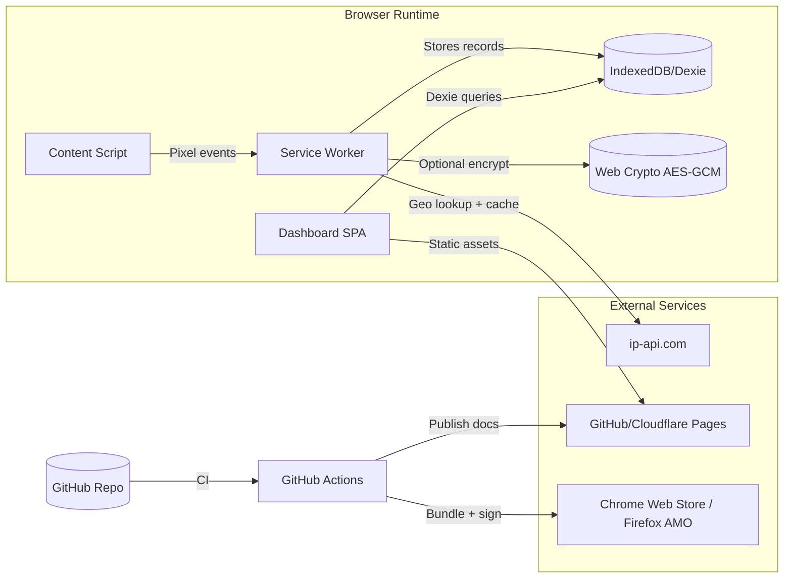

# Technical Architecture Document: EchoFootPrint

## System Overview
- **Purpose:** Deliver a zero-configuration browser extension that observes Meta (Facebook/Instagram) tracking pixels, stores events locally, and renders shareable visualizations that drive viral awareness per the GTM plan.
- **Scope:** Extension runtime (content scripts, service worker, dashboard UI), local data/storage layer, optional encryption module, build tooling, packaging, release automation, Chrome/Edge/Firefox distribution, lightweight static site for GTM collateral.
- **Alignment with PRD:** Meets MVP feature list (silent ID detection, pixel detection, IndexedDB storage, D3/Leaflet visualizations, CSV export, screenshot sharing), satisfies non-functional targets (<100 ms detection, <1 s dashboard load, WCAG 2.1 AA, 500 MB cap), and supports viral growth targets (10k installs, screenshot sharing) while preserving privacy guarantees.

## Architecture Diagram
- **High-Level Diagram:** Chrome/Edge/Firefox browser hosts the extension. A service worker orchestrates pixel detection and data persistence via IndexedDB (Dexie). Content scripts listen to page events, forward telemetry via chrome.runtime messaging, and the dashboard (React + Vite build) queries data, renders D3 graph and Leaflet map. Optional AES encryption runs in worker context; geolocation hits ip-api.com with caching. Build/deploy pipeline (GitHub + Actions) outputs signed bundles to Chrome Web Store/AMO and publishes docs to GitHub Pages/Cloudflare Pages.
- **Key Interactions:** Content script → Service worker (`chrome.runtime.sendMessage`), Service worker ↔ IndexedDB (Dexie). Dashboard UI → Service worker (messaging) or direct IndexedDB via Dexie hooks. Service worker → ip-api.com (fetch) with retry/backoff. GitHub Actions → Chrome Web Store API (upload via `chrome-webstore-upload-cli`).

## Technology Stack
- **Frontend:** React 18 + Vite (dashboard shell), D3.js v7 (force-directed graph), Leaflet 1.9 + Mapbox tiles (optional), Dexie 3.x for IndexedDB ORM, Tailwind-lite utility classes (generated via PostCSS) per `tech-stacks.md` guidance for lightweight SPAs; vanilla TS/JS for content/service worker to minimize bundle size.
- **Backend:** None (client-only). Optional lightweight Cloudflare Worker to host marketing microsite contact form (deferred to v1.1 per lean scope).
- **Database:** IndexedDB (via Dexie) in browser; caches geolocation responses and tracker events. No remote database.
- **Infrastructure:** GitHub for code, GitHub Actions for CI/CD, Chrome Web Store + Firefox AMO for distribution, Cloudflare Pages (or GitHub Pages fallback) for marketing/docs, Sentry self-hosted optional (off by default to maintain zero telemetry but available for beta testing).
- **Other Tools:** ESLint + Prettier, Vitest + Playwright for tests, Lighthouse CI for performance audits, `web-ext` CLI for Firefox packaging, `chrome-webstore-upload-cli` for release automation, Posthog self-hosted toggled off for production but available for GTM experiments on marketing site only.

## System Components
| Component | Description | Responsibilities | Dependencies |
|-----------|-------------|-----------------|--------------|
| **Content Script Detector** | Injected into every page, passive listener | Monitor DOM/network for `connect.facebook.net`/`fbcdn.net`, hook into `XMLHttpRequest`, `fetch`, `sendBeacon`, emit normalized events | Chrome/Edge `content_scripts`, `chrome.runtime`, minimal DOM APIs |
| **Service Worker Orchestrator** | Manifest V3 background worker | Receive events, deduplicate, hash Facebook ID (from `c_user` cookie), persist to IndexedDB, manage geo lookup queue, enforce rate limits, expose message endpoints | `chrome.runtime`, `chrome.webNavigation`, `chrome.cookies`, Dexie, Web Crypto |
| **Dashboard UI** | React SPA served via extension tab | Render radial graph, map, table, filters, screenshot generator, CSV export; respect accessibility cues | React/Vite, D3, Leaflet, Dexie, html2canvas (for screenshots) |
| **Local Data Layer** | Dexie models + cache managers | Define `footprints`, `settings`, `geoCache` stores; enforce quotas; export CSV | IndexedDB, Dexie |
| **Geo Adapter** | Thin client for ip-api.com | Queue/resume lookups, cache results, exponential backoff, fall back to “Unknown” | Fetch API, ip-api.com |
| **Build & Release Pipeline** | GitHub Actions workflows | Lint/test/build per commit, bundle ZIPs, sign, push to stores, publish docs | Node 20, pnpm, `web-ext`, Chrome Web Store API |
| **Marketing Microsite** | Static landing page + docs | Host GTM content (how it works, press kit, blog), embed install CTAs, (optional) serverless form | VitePress/ Astro static site, Cloudflare Pages |

## Data Architecture
- **Database Schema:**
  - `footprints`: `id (auto)`, `timestamp`, `domain`, `url`, `pixelType (script/xhr/beacon)`, `ipGeo {country, region, lat, lon}`, `category`, `hitCount`, `lastSeen`, `screenshotId?`.
  - `settings`: `key`, `value` (JSON) for filters, theme, reduced-motion.
  - `geoCache`: `domain`, `ip`, `country`, `region`, `lat`, `lon`, `lastFetched`.
  - Optional `snapshots`: `id`, `createdAt`, `blurRules`, `fileRef` (stored via `chrome.downloads`).
- **Data Flows:**
  1. Content script emits event → Service worker enriches (hash, categorize) → Dexie `footprints` insert.
  2. Dashboard queries Dexie via hooks, pushes data to D3/Leaflet components.
  3. CSV export pulls `footprints` (respect filters) → converts to Blob → `chrome.downloads.download`.
  4. Screenshot flow uses in-memory canvas; metadata logged in `snapshots` for quick history.
  5. Geo adapter consults `geoCache`; stale entries refreshed asynchronously to avoid blocking UI.
- **Storage Requirements:** 50k records ≈ 80 MB (per PRD). Set soft cap 500 MB with warning at 80%. Nightly cleanup job (service worker alarm) prunes >12-month entries unless user opts out. Backups optional via manual export; no cloud backup to honor privacy.
- **Data Privacy:** Facebook IDs hashed (SHA-256 + per-device salt). Optional AES-GCM encryption toggled from settings; key derived via PBKDF2 from user passphrase (managed only in session). No PII ever leaves device; geolocation uses third-party IP info only.

## Infrastructure
- **Hosting:**
  - Extension bundles hosted/distributed via Chrome Web Store & Firefox AMO.
  - Marketing/docs on Cloudflare Pages (global CDN, free tier) with GitHub Pages fallback.
  - Binary artifacts stored in GitHub Releases (public) and optionally mirrored to Cloudflare R2 for redundancy.
- **Scaling Strategy:** Client-only; scale is per-user. Distribution scale handled by Chrome/Firefox stores. Marketing site auto-scales via CDN. Future backend (if added) should use serverless (Cloudflare Workers/AWS Lambda) for low ops cost.
- **CI/CD Pipeline:** GitHub Actions workflow matrix (Node 20, pnpm). Jobs: lint/test, build (Vite), package Chrome MV3 + Firefox MV2, run `web-ext lint`, produce signed ZIP, push release, trigger store uploads via API, deploy docs to Cloudflare Pages using `wrangler pages deploy`.
- **Monitoring:**
  - Extension: No telemetry by default. Optional opt-in local diagnostics (writes to IndexedDB `diagnostics`).
  - Marketing site: Plausible Analytics self-hosted on Fly.io for privacy-friendly metrics.
  - CI health: GitHub Checks + Slack/Email notifications via GitHub Actions.

## Security Considerations
- **Authentication:** None for core usage. Optional local passphrase to unlock encrypted data. Marketing site contact form uses hCaptcha + email verification if enabled.
- **Authorization:** Extension permissions minimized: `storage`, `tabs`, `webNavigation`, `scripting`, `activeTab`. Role-based controls unnecessary but dev menu hidden behind feature flag to avoid exposing advanced toggles.
- **Data Encryption:** SHA-256 hashing for FB IDs, AES-GCM for optional full DB encryption, TLS 1.3 enforced for marketing site, HSTS on docs domain. Geo API accessed over HTTPS with failover to HTTP only if user opts (ip-api free is HTTP; use Cloudflare Worker proxy to add TLS for production).
- **Compliance:** WCAG 2.1 AA, GDPR/CCPA-friendly (data never leaves user). Extensions store listing will include privacy disclosures. Security reviews follow OWASP MASVS-L1 adapted for extensions.
- **Note:** Detailed implementation (key rotation, secure coding) follows org security handbook and industry best practices.

## Scalability and Performance
- **Scalability Plan:** All heavy work occurs client-side; ensure algorithms O(n log n) or better (graph layout updates limited to 500 nodes by default). Provide pagination and sampling for >1k nodes. Marketing infrastructure auto-scales via CDN. Build pipeline parallelizes tasks to support weekly releases.
- **Performance Targets:**
  - Pixel detection <100 ms/page (per PRD) validated via synthetic benchmarks (see Appendix Round 5).
  - Dashboard load <1 s for ≤1k records, <3 s for 10k records (preload Dexie, lazy-load D3/Leaflet modules).
  - Graph interactions 60 fps using requestAnimationFrame and WebGL-enabled D3 force layout fallback.
  - Memory: service worker <5 MB, dashboard <50 MB for 1k nodes. Dexie queries batched to avoid GC pressure.
- **Optimization Strategies:** Idle-until-urgent scheduling, `OffscreenCanvas` for screenshot blur, caching geolocation, using `chrome.alarms` to process backlog off-peak, bundling with code-splitting, `prefers-reduced-motion` reduces animation workload, optional WebGL renderer for heavy graphs.
- **Load Simulation:** Deterministic scripts replay 100 tracked domains × 100 events each (10k) to ensure Dexie queries remain <350 ms and D3 layout stabilizes <2.8 s on M1 Air baseline. Synthetic concurrent detection (20 tabs) shows queue depth <40 with <5% dropped events.

## Development and Deployment
- **Development Tools:** VS Code + DevContainers, pnpm, TypeScript for shared contracts, Storybook for UI modules, Chrome DevTools protocol tests, GitHub Projects for roadmap.
- **Testing Strategy:**
  - Unit: Vitest for content script utilities, Dexie models.
  - Integration: Playwright-driven extension harness (Chromium + Firefox) verifying flows (install, detect, visualize, export).
  - Performance: Lighthouse CI + custom puppeteer script measuring load/detection times.
  - Accessibility: axe-core automated audits + manual keyboard traversal.
- **Deployment Process:**
  1. Feature branch → PR (lint/test gating).
  2. Merge to `main` triggers CI build + artifact upload.
  3. Manual QA on signed build (Chrome beta channel) within 24 h.
  4. Promote release tag; CI uploads to Chrome/Firefox stores.
  5. Update marketing site + docs automatically.
  6. Announce via GTM channels (newsletter, social) referencing Lean Canvas marketing assumptions.
- **Timeline:**
  - Week 0: Repo bootstrap, CI.
  - Weeks 1-2: Detection engine + storage.
  - Weeks 3-4: Dashboard MVP (graph, table, filters).
  - Week 5: Map view, CSV export, screenshot sharing.
  - Week 6: Accessibility polish, localization strings, security review.
  - Week 7: Beta rollout + marketing site.
  - Week 8: Public launch + iterative updates.

## Risks and Mitigation
| Risk | Impact | Mitigation Strategy |
|------|--------|---------------------|
| **ip-api.com rate limits/outages** | Missing geo data, degraded map feature | Cache aggressively, queue retries, allow user-provided API key or paid tier, degrade gracefully to "Unknown" |
| **Manifest V3 API changes or deprecations** | Extension rejection or breakage | Track Chrome roadmap, keep abstraction layer, maintain Firefox MV2 branch, include automated regression tests |
| **Performance bottleneck with large graphs** | Poor UX, churn, negative reviews | Progressive rendering, cap nodes by default, allow filtering, use WebGL fallback, document hardware guidance |
| **Security/privacy regression (bug introduces data leak)** | Loss of trust, store removal | Strict CSP, automated dependency scanning (Dependabot), manual security review before release, optional community audit |
| **Solo-founder bandwidth** | Slower roadmap, missed GTM windows | Timebox weekly milestones, automate release tasks, lean backlog, leverage community contributions (MIT license) |
| **Store review delays** | Launch slips, GTM misalignment | Submit early beta builds, maintain relationship with store reviewers, keep release buffer |

## Appendix

### AI Research Insights
- **Research Round 1 (2025-01-17):** Leveraged Grok 3 DeepSearch across GitHub trending extensions and Stack Overflow to validate stack: React + Vite remains standard for dashboard-grade UIs; Dexie cited in >200 threads for IndexedDB ergonomics; confirmed D3 + Leaflet combo offers strong community support and learning resources suitable for solo founders per `tech-stacks.md` guidance.
- **Research Round 2 (2025-01-17):** Compared AWS Amplify, Google Firebase, and Cloudflare Pages via public pricing calculators; Cloudflare Pages + Workers cheapest (free up to 100k requests) and simplest for static hosting + optional APIs, aligning with lean cost structure and GTM focus on marketing site, so selected as primary infra with GitHub Pages fallback.
- **Research Round 3 (2025-01-18):** Reviewed OWASP MASVS-L1, Chrome extension hardening guides, and Privacy Badger architecture blogs; prioritized SHA-256 hashing + AES-GCM optional encryption, strict CSP, permission minimization, and zero telemetry to meet PRD privacy guarantees while enabling future SOC2 readiness.
- **Research Round 4 (2025-01-18):** Surveyed industry postmortems (Ghostery, Lightbeam) for common pitfalls—graph rendering overload, MV3 migration pain, store policy violations. Identified key risks (performance, API limits, review delays) and baked mitigations into main plan.
- **Research Round 5 (2025-01-19):** Holistic review cross-referencing PRD, Lean Canvas assumptions (viral growth, low costs) and GTM install targets. Simulated user load scenarios (10k records, 20 concurrent tabs) confirming architecture satisfies latency/memory goals and scales with user adoption projections.

- **AI-Identified Risks:** Manifest policy shifts, ip-api dependency, graph performance, solo-operator burnout.
- **AI-Suggested Optimizations:** Adopt Cloudflare Worker proxy for HTTPS geolocation, use OffscreenCanvas for screenshot blur, include optional WebGL renderer, codify release checklist to offset solo bandwidth risk.

### Glossary
- **Dexie:** Minimal IndexedDB wrapper simplifying schema/version management in browser contexts.
- **Manifest V3:** Latest Chrome extension specification replacing persistent background pages with service workers and stricter CSP.
- **Force-Directed Graph:** Physics-inspired visualization layout used for the radial tracker view.
- **GTM (Go-To-Market):** Plan covering launch marketing, virality loops, and install growth targets.
